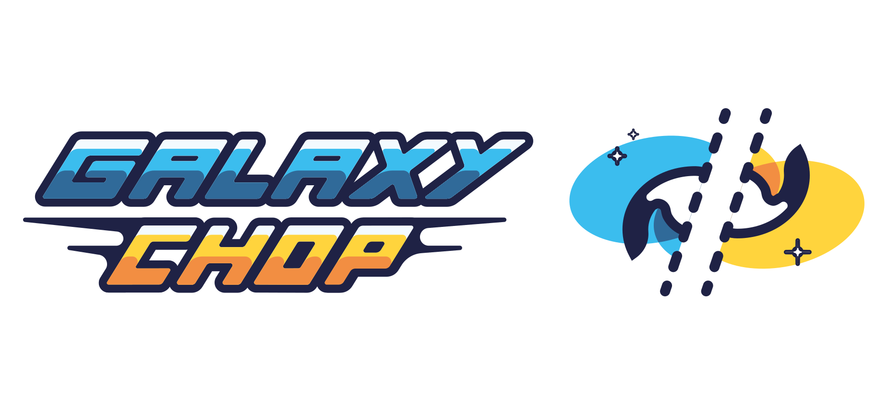

# Welcome to **GalaxyChop**



<!-- BODY -->

[](https://github.com/vcristiani/galaxy-chop/actions/workflows/CI.yml)
[](https://galaxy-chop.readthedocs.io/en/latest/?badge=latest)
[](https://pypi.org/project/galaxychop/)
[](https://github.com/leliel12/diseno_sci_sfw)


**GalaxyChop**  is a Python package that tackles the dynamical decomposition problem by using clustering techniques in phase space for stellar galactic components.

It runs in numerical N-body simulations populated with semi-analytical models and full hydrodynamical simulations, such as [Illustris TNG](https://www.tng-project.org/).

## Motivation

 Galaxies are self-gravitating complex stellar systems formed mainly by stars, dark matter, gas and dust. Star are assembled in different stellar components, such as the disk (thin and thick), the nucleus, the stellar halo and the bar. The components interact with each other and each of them follows its own temporal evolution. For this reason, the description of the formation and evolution  of  galaxies  is  strongly  linked  to  the  formation and evolution of each of these individual components and their assemble in the final galaxy.

 Dynamical decomposition it is a fundamental tool to separate each galaxy component for further study. Numerous methods exist in the literature to perform this task, but there is no tool that allows us to use several of them, providing the possibility of an easy comparison.


## Dynamic decomposition models implemented
- **JHistogram:** Implementation of the dynamic decomposition model of galaxies described by [Abadi et al.(2003)](https://ui.adsabs.harvard.edu/abs/2003ApJ...597...21Aabstract).
- **JThreshold:** Implementation of the dynamic decomposition model of galaxies used in [Tissera et al.(2012)](https://ui.adsabs.harvard.edu/abs/2012MNRAS.420..255T/abstract), [Vogelsberger et al.(2014)](https://ui.adsabs.harvard.edu/abs/2014MNRAS.444.1518V/abstract), [Marinacci et al.(2014)](https://ui.adsabs.harvard.edu/abs/2014MNRAS.437.1750M/abstract), [Park et al.(2019)](https://ui.adsabs.harvard.edu/abs/2019ApJ...883...25P/abstract), etc.
- **KMeans):** Implementation of [Skitlearn](https://scikit-learn.org/stable/about.html#citing-scikit-learn) K-means as a model for dynamical decomposing of galaxies.
- **GCgmm:** Implementation of the dynamic decomposition model of galaxies described by [Obreja et al.(2018)](https://ui.adsabs.harvard.edu/abs/2018MNRAS.477.4915O/abstract).
- **AutoGaussianMixture:** Implementation of the  dynamic decomposition model of galaxies described by [Du et al.(2019)](https://ui.adsabs.harvard.edu/abs/2019ApJ...884..129D/abstract)

**And many more**

## Requirements

You need Python 3.7, 3.8, 3.9 to run GalaxyChop.

### Standard Installation

You could find **GalaxyChop** at PyPI. The standar instalation via pip:

```bash
    $ pip install galaxychop
```

### Development Install

Clone this repo and then inside the local directory execute

```bash
     $ git clone https://github.com/vcristiani/galaxy-chop.git
     $ cd galaxy-chop
     $ pip install -e .
```

## Authors
- Valeria Cristiani ([valeria.cristiani@unc.edu.ar](valeria.cristiani@unc.edu.ar)),
- Antonela Taverna.
- Juan Cabral.
- Martin Chalela.
- Bruno Sanchez.
- Ornela Marioni.
- Nelson Villagra.
- Rafael Pignata.
